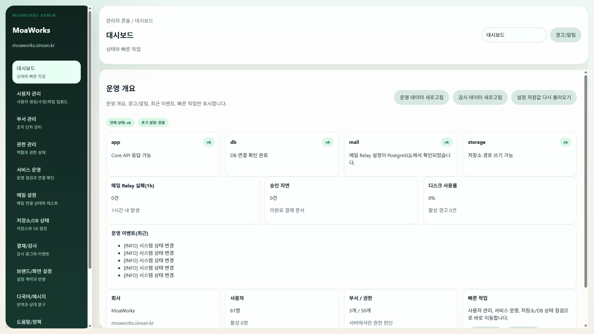

# MoaWorks 관리자·운영자 메뉴얼 v2.0

> 대상: 회사 관리자, 조직·계정 관리자, 서비스 운영자
> 기준 화면: 1920×1080, 기본 글꼴 12px
> 운영 주소 예시: `https://admin.moaworks.sinsan.kr/`
> 주의: 실제 회사에서는 설치 시 확정한 관리자 주소를 사용합니다.

이 메뉴얼은 일상 운영을 화면에서 처리하는 방법을 설명합니다. 서버 설치, Docker 명령, DNS 변경은 [설치·배포 메뉴얼](moaworks-install-deploy-manual-v2.0.md), 장애 복구는 [장애·백업·복구 메뉴얼](moaworks-incident-backup-recovery-manual-v2.0.md)을 따릅니다.

## 1. 관리자 업무 원칙

### 1.1 권한과 책임

- 관리자 계정은 일반 업무 계정과 분리합니다.
- 필요한 사람에게 필요한 기간만 권한을 부여합니다.
- 사용자 비밀번호, API 키, SMTP 자격 증명을 문서나 메신저에 기록하지 않습니다.
- 사용자·조직·권한·Provider 변경 전 현재값과 변경 사유를 기록합니다.
- 변경 후 사용자 화면과 감사 로그에서 반영 결과를 확인합니다.

### 1.2 접속과 종료

1. 회사가 안내한 HTTPS 관리자 주소를 엽니다.
2. 인증서 경고가 없는지 확인합니다.
3. 관리자 계정으로 로그인합니다.
4. 작업이 끝나면 우측 상단의 **로그아웃**을 누릅니다.
5. 공용 PC에서는 브라우저 창을 닫고 저장된 비밀번호를 제거합니다.

*화면 예시 1 — 사용자·조직·상태·감사 정보를 관리하는 관리자 기본 화면*

## 2. 매일 확인하는 운영 대시보드

### 2.1 확인 순서

1. 서비스 상태가 정상인지 확인합니다.
2. 실패한 메일, 지연된 작업, 오류 알림을 확인합니다.
3. 사용자·조직 변경 요청을 처리합니다.
4. 보류된 Provider, 보관 정책, 백업 경고를 확인합니다.
5. 처리 결과를 운영 기록에 남깁니다.

### 2.2 상태 판정

| 표시 | 의미 | 조치 |
|---|---|---|
| 정상 | 최근 점검이 성공했고 임계값을 넘지 않음 | 일상 점검 계속 |
| 경고 | 지연·용량·재시도 등 주의 필요 | 원인 확인 후 담당자 배정 |
| 장애 | 핵심 기능 실패 또는 접근 불가 | 변경 중단 후 장애 절차 시작 |
| 미확인 | 점검값이 오래되었거나 수집 실패 | 장애로 간주하고 수집 경로 확인 |

**중단 조건:** 상태가 미확인인데 정상으로 가정하여 계정·Provider·보관 정책을 변경하지 않습니다.

## 3. 사용자 계정 관리

### 3.1 사용자 생성

1. **사용자 관리 → 사용자 추가**를 엽니다.
2. 로그인 아이디, 이름, 회사 이메일, 소속 부서, 직급을 입력합니다.
3. 중복 아이디와 중복 이메일 검사를 실행합니다.
4. 필요한 기본 역할만 선택합니다.
5. 임시 비밀번호 또는 초대 절차를 선택합니다.
6. 저장한 뒤 사용자 목록과 감사 로그에서 생성 결과를 확인합니다.
7. 사용자가 최초 로그인 후 비밀번호를 변경하도록 안내합니다.

### 3.2 계정 상태 변경

| 상황 | 권장 상태 | 확인 사항 |
|---|---|---|
| 신규 입사 | 활성 | 소속·메일주소·기본 역할 |
| 휴직 | 일시 정지 | 메일 보관, 대리 결재, 공유 자료 |
| 퇴사 예정 | 종료 예약 | 인수인계일, 메일·파일 보관 기간 |
| 퇴사 완료 | 비활성 | 세션 종료, 권한 회수, 자료 소유권 이전 |
| 계정 침해 의심 | 즉시 잠금 | 세션 폐기, 감사 로그 보존, 비밀번호 재설정 |

계정을 삭제하기 전에 메일, 결재, 파일, 일정, 대화의 보존 및 소유권 이전을 완료합니다. 삭제 대신 비활성화를 우선 사용합니다.

### 3.3 비밀번호 재설정

1. 본인 확인 절차를 완료합니다.
2. 관리 화면에서 기존 비밀번호를 볼 수 없는지 확인합니다.
3. 재설정 링크 또는 임시 비밀번호를 발급합니다.
4. 모든 기존 세션 종료 옵션을 선택합니다.
5. 사용자에게 별도 채널로 전달하고 최초 로그인 변경을 확인합니다.

## 4. 부서와 조직도

### 4.1 부서 생성·이동

1. **조직 관리**에서 상위 부서를 선택합니다.
2. 부서명, 부서 코드, 정렬 순서, 책임자를 입력합니다.
3. 저장 후 사용자 조직도에서 계층을 확인합니다.
4. 부서를 이동할 때 하위 부서와 구성원이 함께 이동하는지 미리 확인합니다.

### 4.2 조직 변경 전 점검

- 동일 부서 코드가 없는가?
- 결재선이 부서장·상위부서를 참조하는가?
- 공용 주소록·일정·파일 권한이 부서를 참조하는가?
- 퇴사자나 비활성 사용자가 책임자로 남아 있지 않은가?
- 변경 후 기존 문서의 감사 이력이 유지되는가?

**중단 조건:** 결재선과 자료 권한의 영향 범위가 확인되지 않으면 조직 이동을 저장하지 않습니다.

## 5. 역할과 권한

### 5.1 최소 권한 적용

1. 사용자 또는 역할을 선택합니다.
2. 현재 권한과 요청된 업무를 비교합니다.
3. 필요한 메뉴·행위만 추가합니다.
4. 유효 기간이 있는 임시 권한은 종료일을 설정합니다.
5. 저장 후 일반 사용자 화면에서 실제 노출 범위를 확인합니다.
6. 감사 로그에 요청자·승인자·변경 사유가 남았는지 확인합니다.

### 5.2 권한 분리 권장

| 역할 | 허용 예 | 제한 예 |
|---|---|---|
| 사용자 관리자 | 계정 생성·잠금·부서 배치 | Provider·백업 설정 |
| 조직 관리자 | 부서·직책·공용 주소록 | 시스템 비밀값 |
| 메일 운영자 | 큐·실패·격리·도메인 상태 | 사용자 비밀번호 |
| 감사 담당자 | 감사 로그 조회·내보내기 | 기록 수정·삭제 |
| 시스템 관리자 | 상태·정책·Provider·복구 | 업무 내용 임의 열람 |

## 6. 메일 운영

### 6.1 일상 점검

1. 메일 Provider 상태를 확인합니다.
2. 발송 대기·재시도·실패 건수를 확인합니다.
3. 외부 수신 처리량과 격리·스팸 판정을 확인합니다.
4. 발신 도메인의 SPF·DKIM·DMARC 상태를 확인합니다.
5. 실패 건은 수신자, 시각, 오류 분류, 재시도 여부만 기록하고 본문은 최소한으로 취급합니다.

### 6.2 Provider 구분

- **OCI Email Delivery:** 운영 환경에서 인증된 SMTP 제출 포트로 외부 발신합니다.
- **자체 메일 엔진:** 개발·검증 환경에서 외부 송수신 기능과 메일 저장 흐름을 검증합니다.
- Provider 전환은 저장만으로 끝내지 않고 연결 테스트, 실제 외부 수신, 회신 수신까지 확인합니다.
- 스팸함 도착은 전송 기능 실패와 동일하지 않습니다. 인증 결과와 수신 서버 정책을 따로 기록합니다.

### 6.3 실패 처리

| 실패 분류 | 확인 | 조치 |
|---|---|---|
| 인증 실패 | Provider 자격 증명, 발신자 승인 | 비밀값 노출 없이 재설정 |
| 수신자 거부 | 주소·도메인·SMTP 응답 | 주소 확인 후 재발송 |
| 억제 목록 | OCI suppression 상태 | 원인 해결 후 승인된 절차로 해제 |
| 일시 지연 | 재시도 횟수·다음 시각 | 자동 재시도 관찰 |
| 도메인 인증 | SPF·DKIM·DMARC | DNS 전파와 레코드 중복 확인 |

## 7. 결재·메신저·파일 운영

### 7.1 결재

- 결재 문서를 관리자가 임의로 승인하지 않습니다.
- 퇴사·휴직으로 결재선이 멈춘 경우 대리자 또는 재기안 정책을 적용합니다.
- 상태 변경 전 문서 번호, 현재 결재자, 변경 사유를 기록합니다.
- 감사 이력이 손상되거나 과거 시점이 다시 쓰이지 않는지 확인합니다.

### 7.2 메신저

- 신고·보존 요청은 회사 정책과 권한에 따라 처리합니다.
- 대화방 삭제와 사용자의 나가기를 구분합니다.
- 업무 증적 보존이 필요한 경우 내보내기 전에 법무·보안 정책을 확인합니다.

### 7.3 파일

- 개인·부서·공용 영역의 소유자를 구분합니다.
- 퇴사자 파일은 승인된 담당자에게 소유권을 이전합니다.
- 악성 파일 또는 대량 업로드가 의심되면 공유를 중지하고 원본 해시와 감사 기록을 보존합니다.
- 보관 기간이 지나기 전에는 휴지통을 강제로 비우지 않습니다.

## 8. 공지·일정·주소록 운영

1. 공지는 대상, 게시 기간, 중요도, 작성자를 확인합니다.
2. 전사 일정은 시간대와 반복 규칙을 확인합니다.
3. 공용 주소록은 중복 이메일, 퇴사자, 외부 연락처 구분을 점검합니다.
4. 변경 후 사용자 홈과 알림에서 노출 결과를 확인합니다.

## 9. LLM 번역 설정

### 9.1 노출 원칙

- LLM Provider가 설정되고 연결 테스트가 성공한 경우에만 사용자 번역 기능을 표시합니다.
- 설정하지 않았거나 연결 실패한 경우 번역 메뉴와 버튼을 사용자에게 보이지 않습니다.
- 지원 Provider: CEREBRAS, GROQ, MISTRAL, OPENAI, UPSTAGE, GEMINI, OPENROUTER, ANTHROPIC, OLLAMA.

### 9.2 설정 절차

1. **환경설정 → LLM/번역**을 엽니다.
2. Provider를 선택합니다.
3. 해당 Provider가 지원하는 모델 목록에서 모델을 선택합니다. 모델명 임의 입력은 사용하지 않습니다.
4. API 키 또는 내부 연결 정보를 비밀 입력란에 저장합니다.
5. **연결 테스트**를 실행합니다.
6. 성공 응답, 사용 모델, 응답 시각을 확인합니다.
7. 사용자 화면에서 번역 기능이 나타나는지 확인합니다.

**주의:** API 키를 화면 캡처, 운영 로그, 매뉴얼, Git 저장소에 포함하지 않습니다.

## 10. 감사 로그

### 10.1 반드시 확인할 변경

- 로그인 성공·실패·잠금
- 사용자 생성·상태·비밀번호 재설정
- 부서·역할·권한 변경
- Provider·보관·알림 정책 변경
- 결재 상태의 관리자 개입
- 파일 소유권·공유·삭제
- 백업·복구·업데이트·롤백

### 10.2 조회와 내보내기

1. 기간과 행위 유형을 좁혀 조회합니다.
2. 사용자, 대상, 이전값, 변경값, 시각, 요청 식별자를 확인합니다.
3. 내보내기 파일은 접근 제한된 운영 증적 위치에 저장합니다.
4. 개인 정보가 불필요한 공유본은 마스킹합니다.
5. 감사 로그 자체의 삭제·수정 권한을 운영 권한과 분리합니다.

## 11. Help와 운영 안내

*화면 예시 2 — 관리자 업무 도움말과 운영 안내*

1. 화면의 **Help** 또는 `i` 아이콘을 사용해 현재 항목의 의미를 확인합니다.
2. 설명 박스를 상시 노출하는 대신 툴팁·팝오버를 사용합니다.
3. 제품 버전과 메뉴얼 버전이 다른 경우 변경 기록을 먼저 확인합니다.
4. 메뉴얼에 없는 운영 변경은 변경 승인과 복구 계획을 작성한 뒤 시행합니다.

## 12. 변경 관리

### 12.1 변경 전

- 변경 목적과 영향 범위를 기록합니다.
- 대상 환경과 현재 버전을 확인합니다.
- 백업과 되돌리기 방법을 확인합니다.
- 사용자 공지와 점검 시간을 정합니다.

### 12.2 변경 후

1. 상태 화면을 확인합니다.
2. 관리자 화면과 사용자 화면에서 대표 기능을 실행합니다.
3. 브라우저 Network에서 내부 서버 주소가 노출되지 않고 같은 출처의 API 경로가 사용되는지 확인합니다.
4. 감사 로그와 운영 기록에 결과를 남깁니다.
5. 문제가 있으면 추가 변경 전에 롤백 또는 장애 절차로 전환합니다.

## 13. 관리자 문제 해결

| 증상 | 우선 확인 | 다음 조치 |
|---|---|---|
| 관리자 로그인 실패 | 계정 잠금, 주소, 시간, 인증서 | 다른 관리자에게 잠금·감사 로그 확인 요청 |
| 사용자가 보이지 않음 | 검색 조건, 부서, 상태 | 조직 배치와 동기화 상태 확인 |
| 권한 반영 지연 | 저장 결과, 세션, 역할 상속 | 재로그인 후 감사 로그 확인 |
| 외부 메일 실패 | Provider, 큐, 도메인 인증 | 장애 메뉴얼의 메일 절차 실행 |
| 알림 누락 | 알림 정책, 사용자 설정, 이벤트 상태 | 대표 이벤트 재현 및 전달 경로 확인 |
| 파일 용량 경고 | 저장소 사용량, 대용량 업로드 | 보관 정책과 증설 계획 확인 |
| 상태값 미확인 | 마지막 점검 시각, 수집 실패 | 장애로 간주하고 운영자 호출 |

## 14. 운영자 완료 체크리스트

- [ ] 관리자 계정과 일반 계정을 분리했다.
- [ ] 사용자 생성·잠금·퇴사·소유권 이전 절차를 확인했다.
- [ ] 조직 변경이 결재선과 자료 권한에 미치는 영향을 확인했다.
- [ ] 최소 권한과 감사 로그 절차를 적용했다.
- [ ] 메일 Provider, 큐, 외부 왕복, DNS 인증 점검 방법을 안다.
- [ ] LLM 설정 여부에 따른 번역 기능 노출 원칙을 확인했다.
- [ ] 변경 전 백업·영향·롤백과 변경 후 대표 기능 검증을 수행한다.
- [ ] 장애 시 임의 수정 전에 증적을 보존하고 장애 메뉴얼을 따른다.
