# MoaWorks 일반 사용자 메뉴얼 v2.0

- 대상: MoaWorks로 메일·결재·메신저·일정·주소록·파일 업무를 처리하는 임직원
- 기준일: 2026-08-11
- 검증 예시 주소: `https://user.moaworks.sinsan.kr/`
- 화면 기준: 1920×1080, 기본 본문 12px

> 회사가 별도 도메인을 사용하는 경우 주소의 `moaworks.sinsan.kr` 부분을 회사에서 안내한 주소로 바꾸십시오. 계정과 초기 비밀번호는 관리자에게 받아야 합니다.

## 1. 시작하기

### 1.1 준비사항

1. Chrome, Edge 등 최신 브라우저를 사용합니다.
2. 회사에서 안내한 사용자 포털 HTTPS 주소를 확인합니다.
3. 사용자 아이디, 메일 도메인, 초기 비밀번호를 준비합니다.
4. 공용 PC에서는 비밀번호 저장과 자동 로그인을 사용하지 않습니다.

### 1.2 로그인

1. 사용자 포털을 엽니다.
2. `아이디`에는 `@도메인` 앞부분만 입력합니다.
3. 화면에 표시된 회사 메일 도메인이 맞는지 확인합니다.
4. 비밀번호를 입력하고 `업무 포털 로그인`을 누릅니다.
5. 홈 화면 오른쪽 위에서 이름, 역할, 이메일을 확인합니다.

정상 결과: 왼쪽 메뉴와 오늘의 업무 카드가 표시됩니다. 로그인 실패 시 아이디의 도메인과 대소문자, 비밀번호를 다시 확인하고 계속 실패하면 관리자에게 계정 활성 상태를 문의합니다.

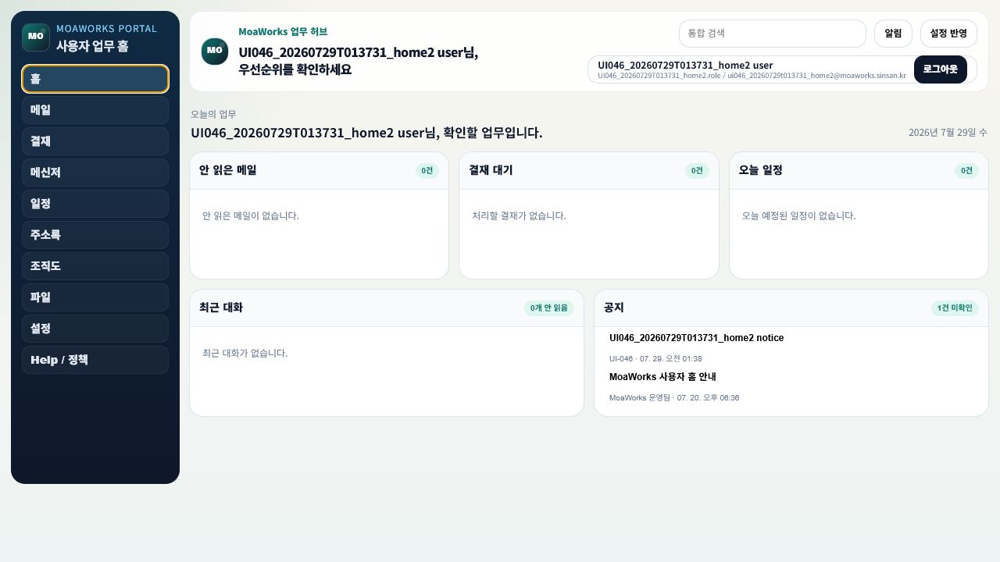

*그림 1. 로그인 후 메일·결재·일정·최근 대화·공지를 한 화면에서 확인합니다.*

### 1.3 화면 구성

| 영역 | 역할 |
|---|---|
| 왼쪽 메뉴 | 홈, 메일, 결재, 메신저, 일정, 주소록, 조직도, 파일, 설정, Help 이동 |
| 상단 검색 | 현재 권한으로 접근할 수 있는 업무 자료 통합 검색 |
| 알림 | 안 읽은 알림 수와 전체 알림 목록 |
| 사용자 영역 | 로그인 계정, 관리자 여부, 로그아웃 |
| 본문 | 선택한 업무의 목록, 상세, 작성 화면 |

## 2. 홈과 통합 검색

### 2.1 오늘의 업무 확인

1. 왼쪽에서 `홈`을 선택합니다.
2. `안 읽은 메일`, `결재 대기`, `오늘 일정`, `최근 대화`, `공지`의 건수를 확인합니다.
3. 카드의 항목을 선택하면 해당 업무 화면으로 이동합니다.
4. 숫자가 예상과 다르면 `새로고침`하거나 다시 로그인합니다.

### 2.2 통합 검색

1. 상단 `통합 검색` 입력란에 제목, 발신자, 본문 일부 등 검색어를 입력합니다.
2. 검색 결과에서 업무 종류와 제목을 확인합니다.
3. 결과를 선택하면 원본 업무로 이동합니다.
4. 권한이 없거나 삭제된 자료는 열리지 않습니다. 관리자에게 권한을 요청하기 전에 결과의 업무 종류와 제목을 기록합니다.

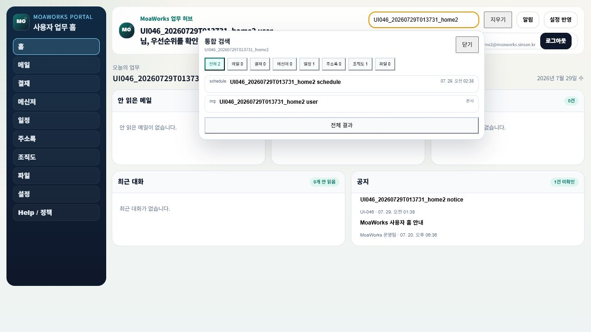

*그림 2. 통합 검색은 여러 업무의 결과를 한곳에 표시하고 원본 화면으로 연결합니다.*

## 3. 알림

### 3.1 전체 알림 보기

1. 상단 `알림`을 선택합니다.
2. `전체`, `안 읽음`, `읽음` 필터로 목록을 좁힙니다.
3. 알림의 제목과 발생 시각, 업무 종류를 확인합니다.
4. 알림을 선택해 원본 업무로 이동합니다.
5. 개별 또는 여러 알림을 읽음 처리합니다.

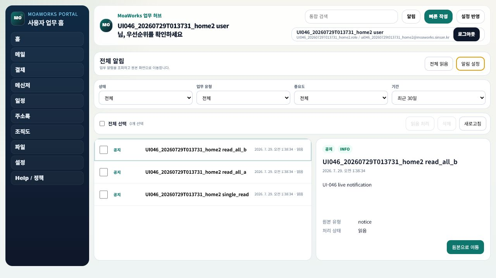

*그림 3. 알림 목록에서 필터, 읽음 처리, 원본 업무 이동을 수행합니다.*

### 3.2 알림이 보이지 않을 때

- `설정 > 알림`에서 해당 업무 알림이 활성화됐는지 확인합니다.
- 브라우저 알림 권한과 MoaWorks 내부 알림은 별개입니다.
- 원본 업무 권한이 사라진 경우 알림은 남아 있어도 원본이 열리지 않을 수 있습니다.

## 4. 메일

### 4.1 메일 화면 이해

1. 왼쪽에서 `메일`을 선택합니다.
2. 왼쪽 메일함에서 받은편지함, 보낸편지함, 임시보관함, 예약메일함, 스팸함, 휴지통을 선택합니다.
3. 가운데 목록에서 메일을 선택합니다.
4. 오른쪽 상세에서 본문, 첨부, 발신·수신 정보와 읽음 상태를 확인합니다.

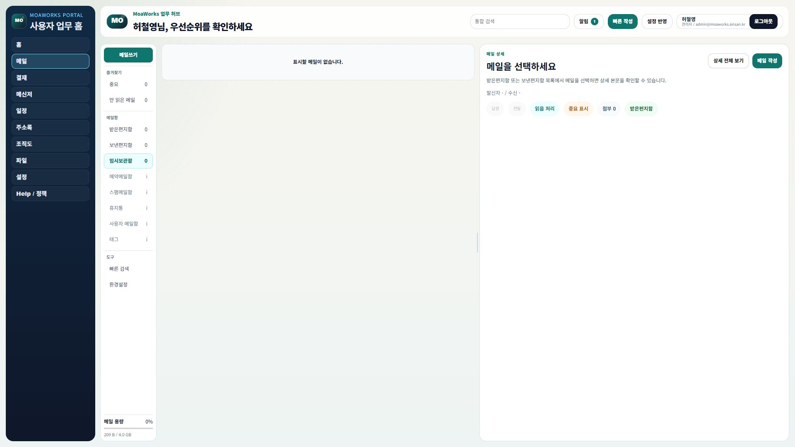

*그림 4. 메일함, 목록, 본문을 나란히 보는 기본 메일 화면입니다.*

### 4.2 메일 검색과 필터

1. 검색란에 제목, 보낸 사람 또는 본문 일부를 입력합니다.
2. 읽음, 중요, 첨부 여부와 정렬 조건을 선택합니다.
3. 여러 메일을 선택하면 읽음·안 읽음, 중요, 이동, 태그, 스팸 지정, 삭제를 일괄 처리할 수 있습니다.
4. 검색 조건을 해제하려면 필터를 `전체` 또는 기본값으로 되돌립니다.

### 4.3 새 메일 작성

1. `메일 작성`을 선택합니다.
2. `받는 사람`에 전체 이메일 주소를 입력하거나 `선택`으로 조직도·주소록에서 찾습니다.
3. 필요하면 `참조`와 `숨은참조`를 입력합니다.
4. 제목과 본문을 작성합니다.
5. 첨부가 있으면 `파일 선택`을 눌러 파일을 추가하고 파일명·용량·개수를 확인합니다.
6. 즉시 보내려면 `즉시 발송`, 원하는 시간에 보내려면 날짜와 시간을 입력한 뒤 `예약 발송`을 선택합니다.
7. 작성 중 보관하려면 `임시저장`을 선택합니다.

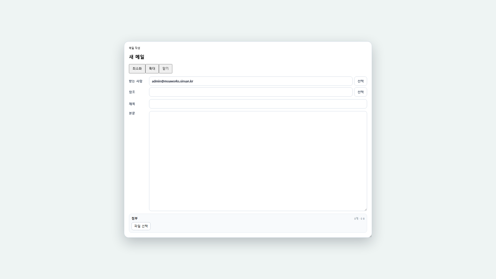

*그림 5. 기본 작성창은 화면 중앙에서 시작하며 수신자, 본문, 첨부, 예약 시간을 한 번에 입력합니다.*

### 4.4 작성창 확대와 복원

1. 작성창 오른쪽 위 `확대`를 누릅니다.
2. 긴 본문은 확대 화면에서 작성합니다.
3. 다시 원래 크기로 돌아가려면 `복원`을 누릅니다.
4. `최소화`는 작성 내용을 유지한 채 목록을 확인할 때 사용합니다.
5. `닫기` 전에 저장되지 않은 내용 경고를 확인합니다.

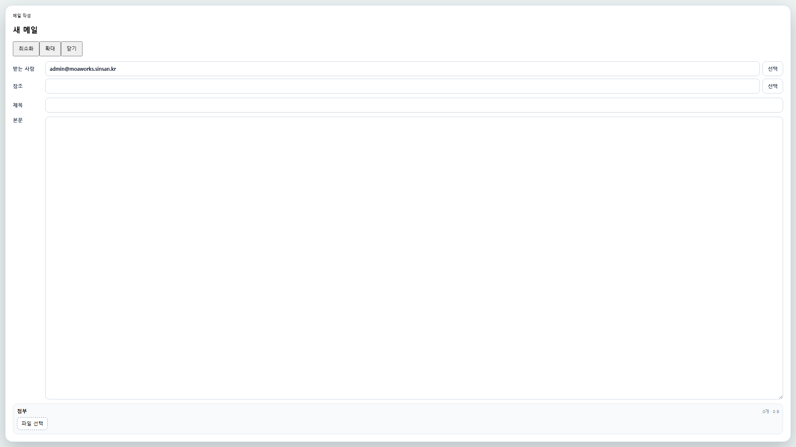

*그림 6. 확대 상태에서는 작성 영역이 화면 전체를 사용하고 본문 공간이 넓어집니다.*

### 4.5 발송 후 확인

1. `보낸편지함`에서 발송한 메일을 찾습니다.
2. 상태가 발송 완료인지 확인합니다.
3. 수신확인 요청이 활성화된 메일은 수신자의 확인 상태를 확인합니다.
4. 외부 메일 서비스가 수신확인 정보를 제공하지 않거나 차단하면 `확인되지 않음`으로 남을 수 있습니다.
5. 발송 실패 시 수신 주소, 첨부 제한, 관리자 공지를 확인하고 재시도합니다.

### 4.6 스팸함 이동과 복원

1. 의심되는 메일을 선택하고 `스팸 지정`을 누릅니다.
2. 스팸함에서 정상 메일을 선택해 `스팸 해제` 또는 받은편지함 이동을 실행합니다.
3. 외부 메일이 받은편지함이 아닌 스팸함에 도착한 것은 메일 송수신 기능 고장과 다를 수 있습니다. 반복되면 관리자에게 발신 도메인과 제목을 전달합니다.

### 4.7 메일 환경설정

`메일 > 설정`에서 기본환경, 서명, 메일함, 스팸, 자동분류, 자동전달, 부재중응답, 외부메일, 최근 보낸 메일을 관리합니다.

- `발송 전 확인`: 실수로 보내는 것을 방지합니다.
- `보낸메일 저장`: 발송 원문을 보낸편지함에 표시합니다.
- `수신확인 요청`: 지원되는 수신 경로에서 읽음 상태를 요청합니다.
- 설정을 바꾼 뒤에는 `저장됨` 표시를 확인합니다.

## 5. 전자결재

### 5.1 문서 작성

1. 왼쪽 `결재`를 선택합니다.
2. `새 결재 진행` 또는 `결재 작성`을 누릅니다.
3. 제목과 본문을 입력합니다.
4. 필요한 파일을 첨부합니다.
5. `결재선`에서 결재자와 순서를 지정합니다.
6. 작성만 보관하려면 `임시저장`, 결재를 시작하려면 `상신`을 선택합니다.

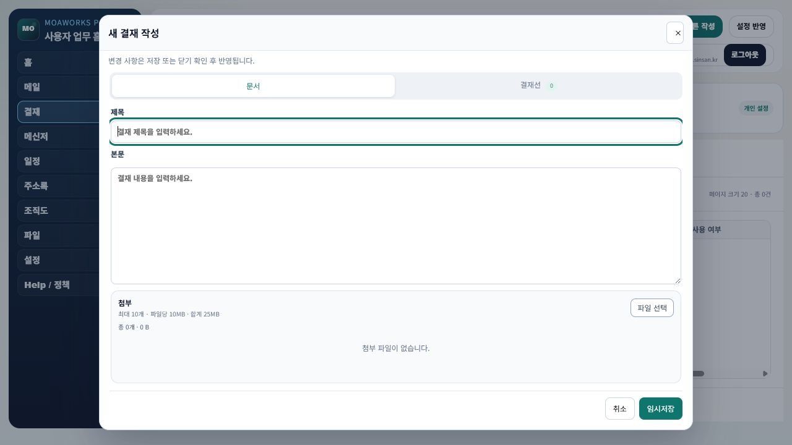

*그림 7. 결재에서 본문을 넓게 작성하고 결재선과 첨부를 함께 지정합니다.*

### 5.2 목록과 상태

| 메뉴 | 의미 |
|---|---|
| 결재 대기 | 현재 내가 처리할 순번인 문서 |
| 수신 | 내 결재 처리가 끝난 문서 |
| 예정 | 내 결재 순번을 기다리는 문서 |
| 개인 문서함 | 내가 작성한 초안과 상신 문서 |

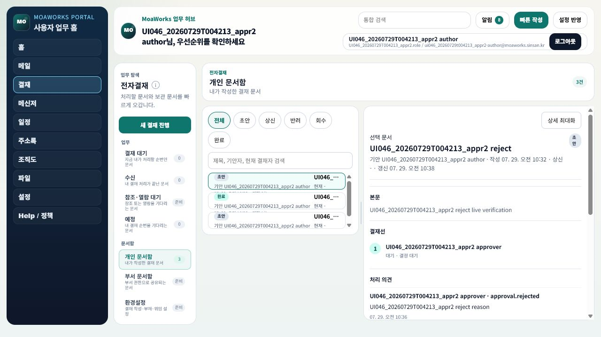

*그림 8. 목록에서 상태를 확인하고 문서를 선택하면 결재선과 처리 이력이 표시됩니다.*

### 5.3 승인·반려·재기안

1. `결재 대기`에서 문서를 선택합니다.
2. 본문, 첨부, 이전 처리 의견, 결재선을 확인합니다.
3. 동의하면 `승인`, 수정이 필요하면 `반려`를 선택합니다.
4. 반려 시에는 다음 사람이 이유를 알 수 있도록 처리 의견을 입력합니다.
5. 반려된 작성자는 원문을 확인하고 `재기안`으로 수정본을 제출합니다.

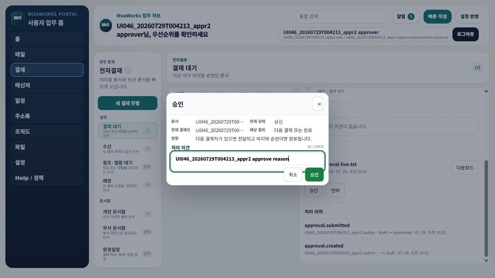

*그림 9. 현재 문서 상태와 사용자 권한에 맞는 결재 처리 버튼만 활성화됩니다.*

## 6. 메신저

### 6.1 대화방 만들기

1. 왼쪽 `메신저`를 선택합니다.
2. `새 대화` 또는 대화방 추가를 누릅니다.
3. 대화방 이름과 참여자를 선택합니다.
4. 생성 후 참여자 목록이 맞는지 확인합니다.

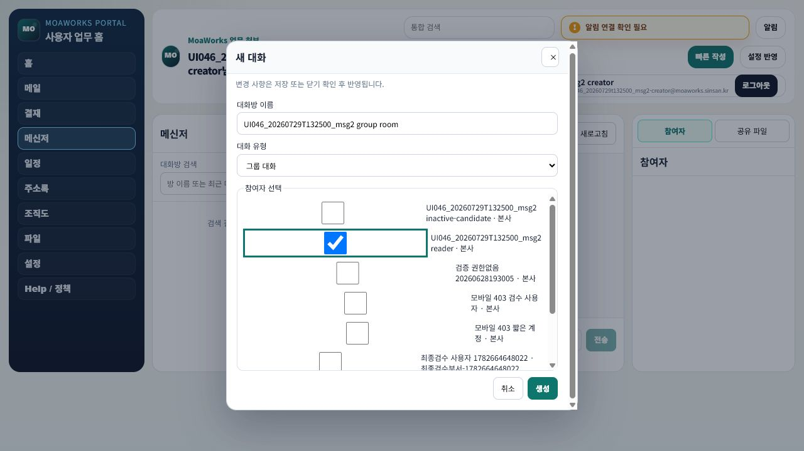

*그림 10. 조직 구성원을 선택해 업무 대화방을 생성합니다.*

### 6.2 메시지와 파일

1. 대화방을 선택합니다.
2. 입력란에 메시지를 작성하고 전송합니다.
3. 파일 첨부는 허용 크기와 형식을 확인한 뒤 전송합니다.
4. 최근 대화, 고정 메시지, 공유 파일에서 필요한 자료를 다시 찾습니다.
5. 연결이 끊겼다가 복구되면 새 메시지와 읽음 상태가 동기화되는지 확인합니다.

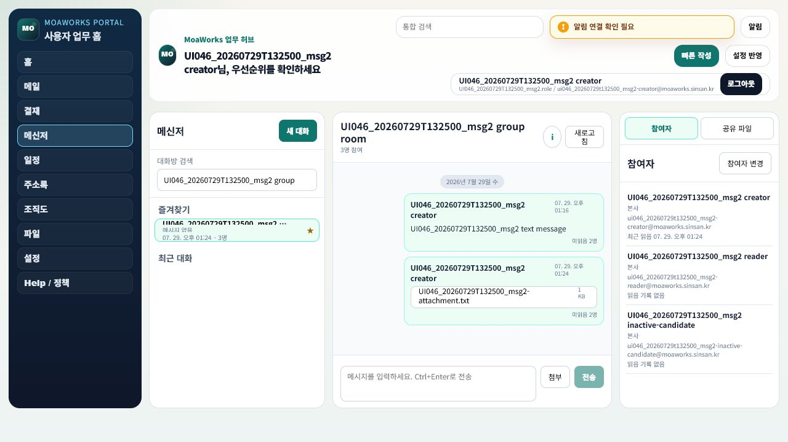

*그림 11. 메시지 시간순 목록과 입력 영역에서 실시간 업무 대화를 처리합니다.*

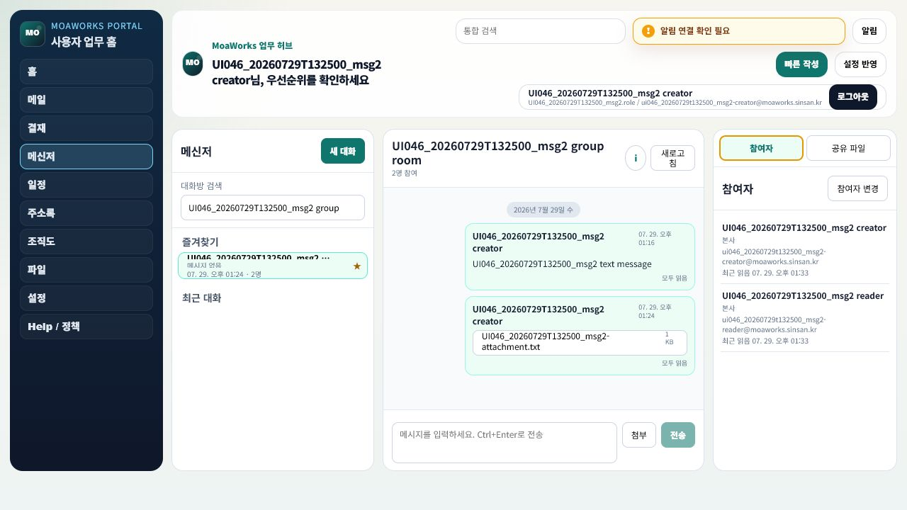

*그림 12. 참여자 화면에서 구성원과 방장 상태를 확인합니다.*

### 6.3 나가기와 삭제

- 일반 참여자는 대화방에서 나갈 수 있습니다.
- 방장은 다른 구성원에게 방장을 이전한 뒤 나갑니다.
- 삭제된 대화방과 파일은 보존 정책에 따라 일정 기간 복구 가능하며, 즉시 물리 삭제되지 않을 수 있습니다.

## 7. 일정

### 7.1 일정 보기

1. 왼쪽 `일정`을 선택합니다.
2. 월간, 주간, 일간 또는 목록 보기를 선택합니다.
3. 개인 일정과 공유 일정을 구분합니다.
4. 날짜를 이동하거나 `오늘`을 눌러 현재 날짜로 돌아옵니다.

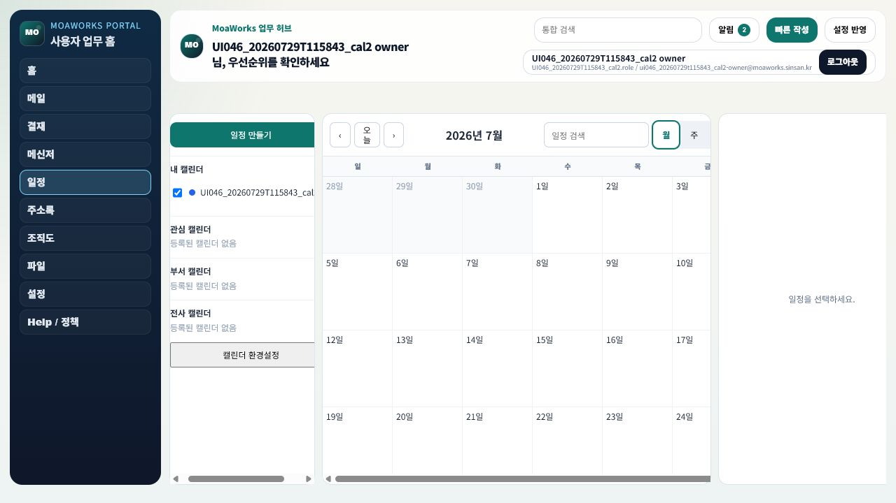

*그림 13. 월간 보기에서 날짜별 일정과 공유 상태를 확인합니다.*

### 7.2 일정 등록과 공유

1. `일정 추가`를 누릅니다.
2. 제목, 시작·종료 시간, 장소, 설명을 입력합니다.
3. 반복 일정이면 반복 조건과 종료일을 설정합니다.
4. 공유가 필요하면 참여자 또는 공유 범위를 선택합니다.
5. 저장 후 달력에서 일정이 표시되는지 확인합니다.

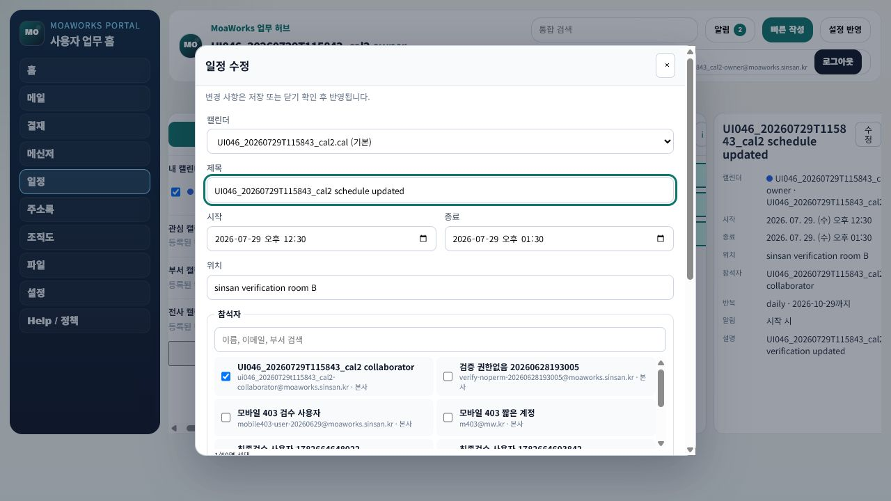

*그림 14. 일정 정보와 참여자·공유 범위를 작성하는 화면입니다.*

## 8. 주소록과 조직도

### 8.1 개인 주소록

1. `주소록 > 개인 주소록`을 선택합니다.
2. 이름, 이메일, 전화로 검색합니다.
3. `연락처 추가`에서 이름과 이메일을 입력하고 필요하면 전화, 회사, 그룹, 메모를 추가합니다.
4. 연락처를 선택해 메일 보내기, 수정, 삭제를 수행합니다.

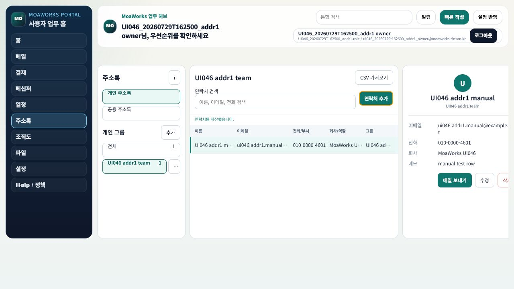

*그림 15. 개인 연락처를 그룹과 검색 조건으로 관리합니다.*

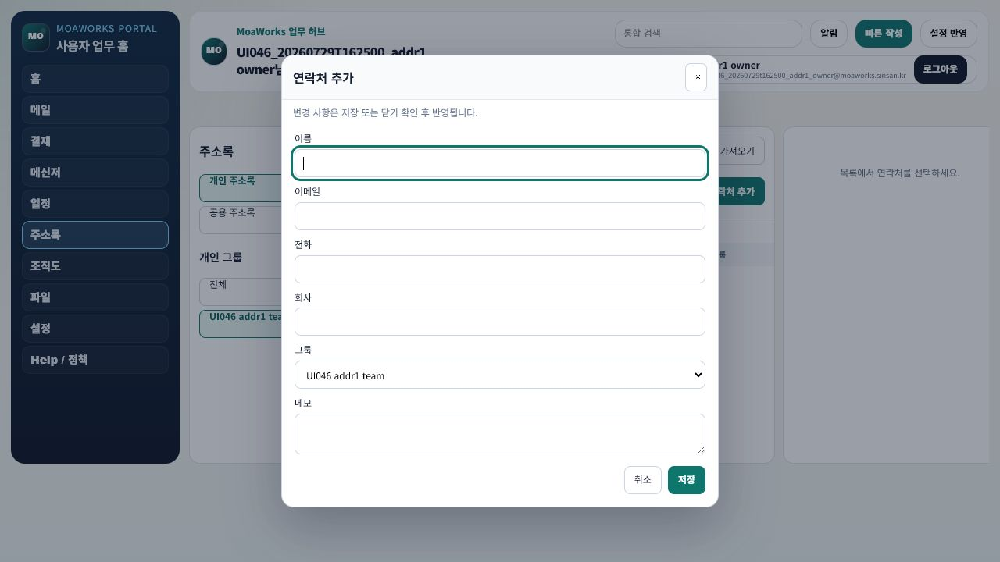

*그림 16. 연락처 필수값과 선택 정보를 입력하는 화면입니다.*

### 8.2 공용 주소록과 조직도

- 공용 주소록은 회사 구성원 정보를 조회하는 영역이며 일반 사용자는 임의 수정할 수 없습니다.
- 조직도에서 부서를 펼쳐 구성원을 찾고 메일·결재·메신저의 대상 선택에 사용할 수 있습니다.

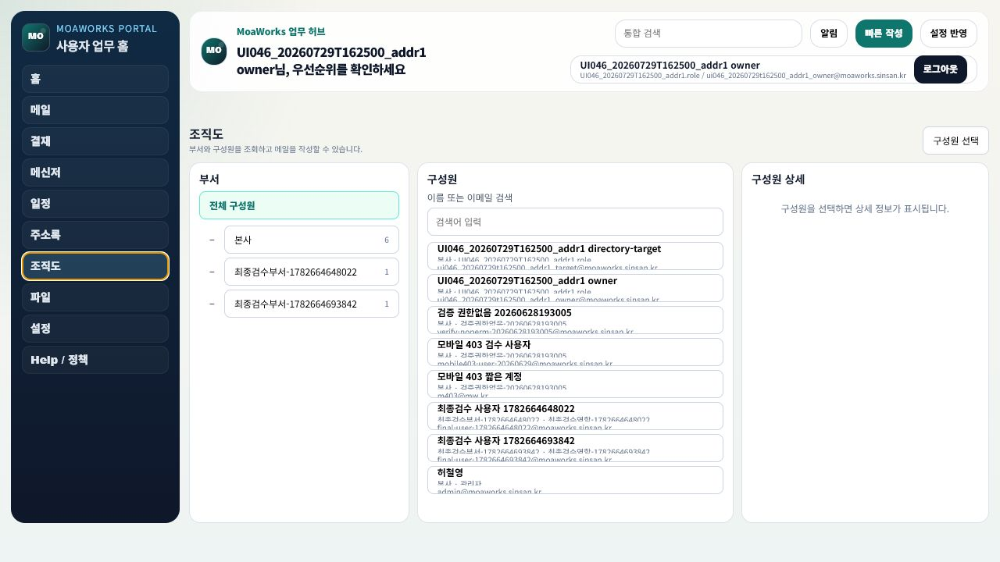

*그림 17. 부서 계층을 펼쳐 구성원과 소속 정보를 확인합니다.*

## 9. 파일

### 9.1 파일과 폴더

1. 왼쪽 `파일`을 선택합니다.
2. 내 파일 또는 공유 파일 영역을 선택합니다.
3. 새 폴더를 만들거나 파일을 업로드합니다.
4. 목록에서 파일명, 크기, 수정일, 공유 상태를 확인합니다.

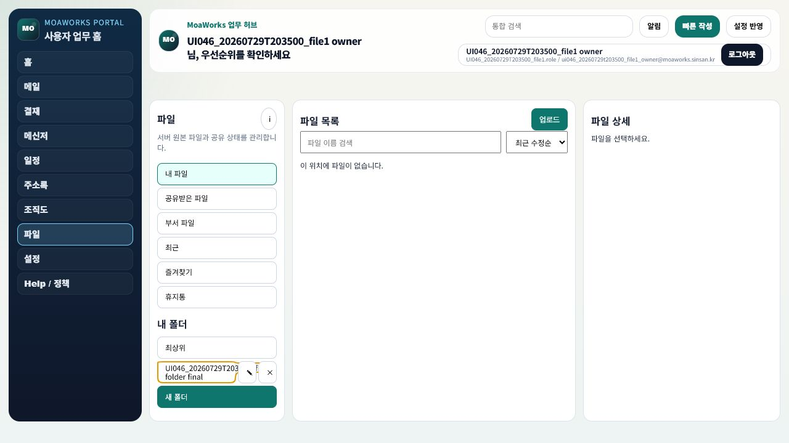

*그림 18. 개인 폴더와 파일을 계층별로 관리하는 화면입니다.*

### 9.2 업로드와 버전

1. 업로드 전에 파일 크기와 허용 형식을 확인합니다.
2. 업로드가 끝날 때까지 브라우저를 닫지 않습니다.
3. 같은 문서를 새 버전으로 올린 경우 버전 기록에서 이전 파일을 확인합니다.
4. 복원 전에 현재 파일을 덮어쓰는지 확인합니다.

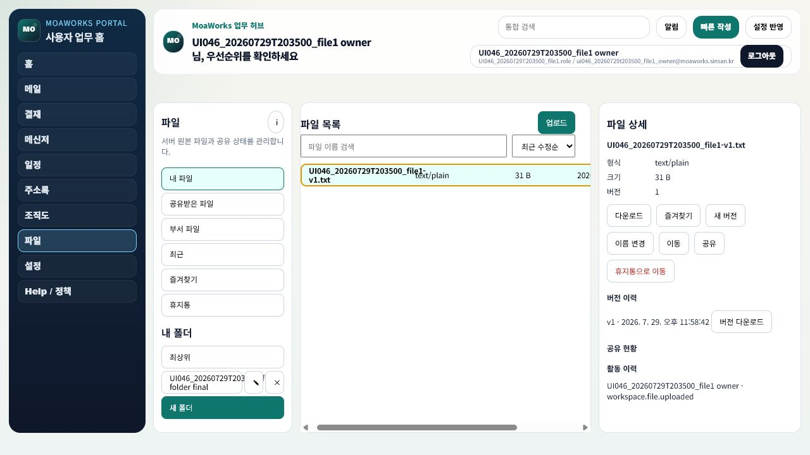

*그림 19. 업로드 파일의 상태와 상세 정보를 확인합니다.*

*그림 20. 파일별 버전과 생성 시각을 확인하고 필요한 버전을 복원합니다.*

### 9.3 공유와 삭제

- 공유 권한은 보기와 편집을 구분합니다.
- 권한이 없는 사용자는 공유 파일을 열거나 수정할 수 없습니다.
- 삭제한 파일은 휴지통으로 이동하며 보존 기간 안에 복원할 수 있습니다.

## 10. 개인 설정과 Help

### 10.1 프로필

1. `설정 > 프로필`을 엽니다.
2. 이름, 연락처 등 허용된 정보를 수정합니다.
3. 저장 완료 메시지를 확인합니다.

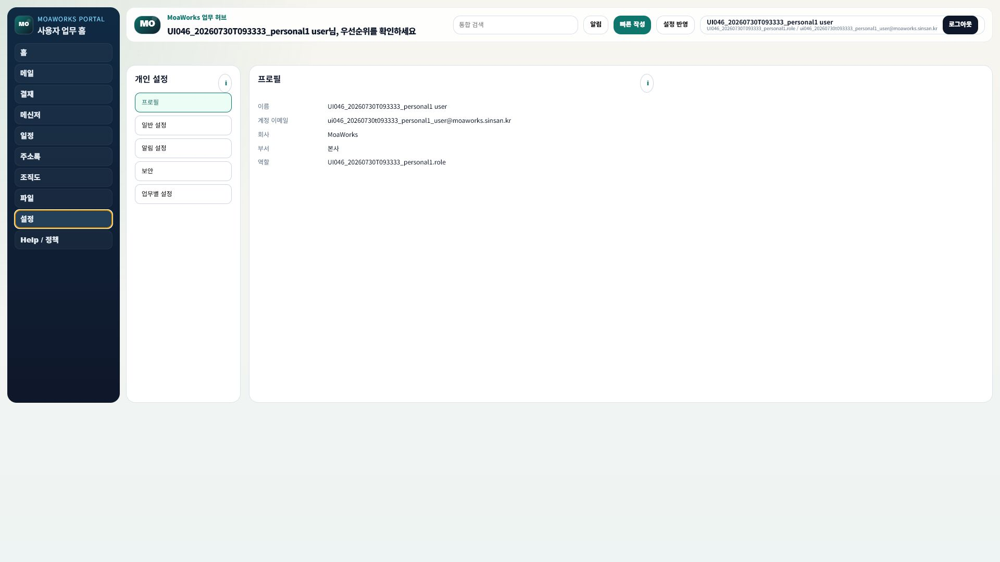

*그림 21. 사용자가 직접 관리할 수 있는 프로필 정보입니다.*

### 10.2 알림 설정

1. `설정 > 알림`을 엽니다.
2. 업무별 알림 사용 여부를 선택합니다.
3. 저장하고 `저장됨` 상태를 확인합니다.

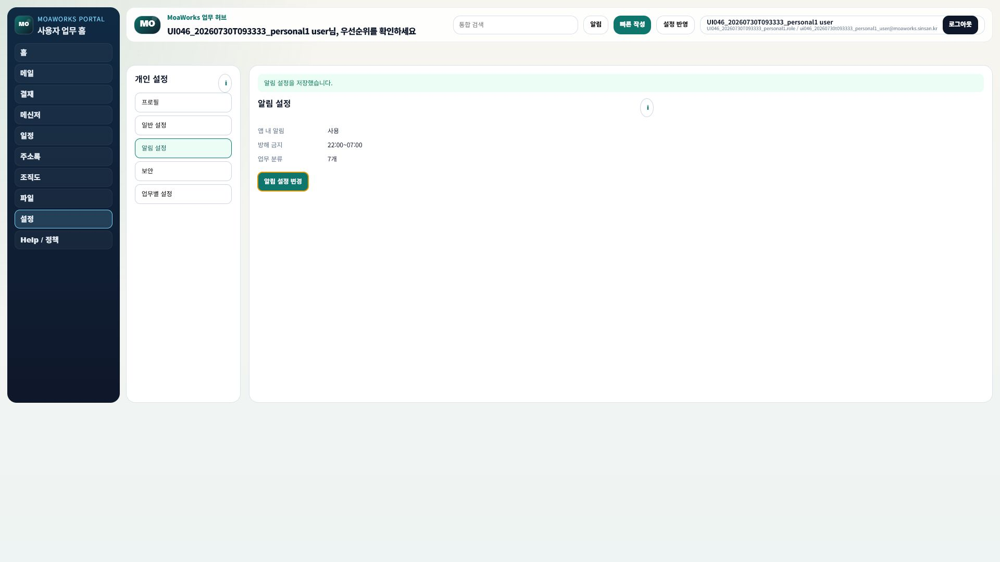

*그림 22. 업무별 알림 수신 조건을 저장합니다.*

### 10.3 번역

- 관리자가 LLM Provider와 모델, API 키를 설정하고 번역을 활성화했을 때만 번역 기능과 화면이 표시됩니다.
- 번역 결과에는 원문 언어, 대상 언어, 사용 모델 또는 캐시 여부가 표시될 수 있습니다.
- 번역 실패 시 원문을 유지하므로 원문을 기준으로 업무를 처리합니다.

### 10.4 Help와 정책

1. `Help / 정책`을 선택합니다.
2. 업무 종류 또는 검색어로 도움말을 찾습니다.
3. 데이터 보존, 개인정보, 메일 정책 등 회사 정책을 확인합니다.

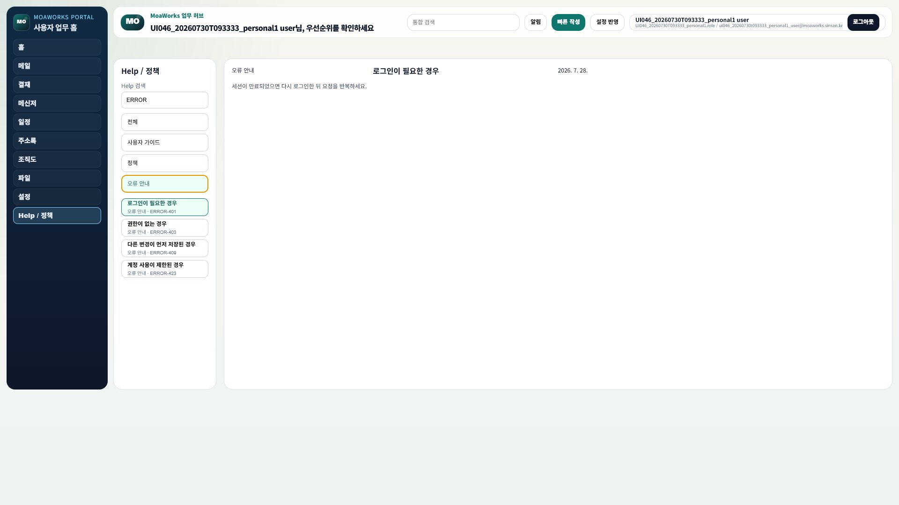

*그림 23. 업무별 도움말과 정책 문서를 검색하는 화면입니다.*

## 11. Android 앱

### 11.1 로그인과 홈

1. 회사가 배포한 Android APK를 설치합니다.
2. 앱이 요구하는 알림·파일 권한을 업무에 필요한 범위에서 허용합니다.
3. 회사 서버 주소와 계정으로 로그인합니다.
4. 홈에서 메일, 결재, 메신저, 알림 카드를 확인합니다.

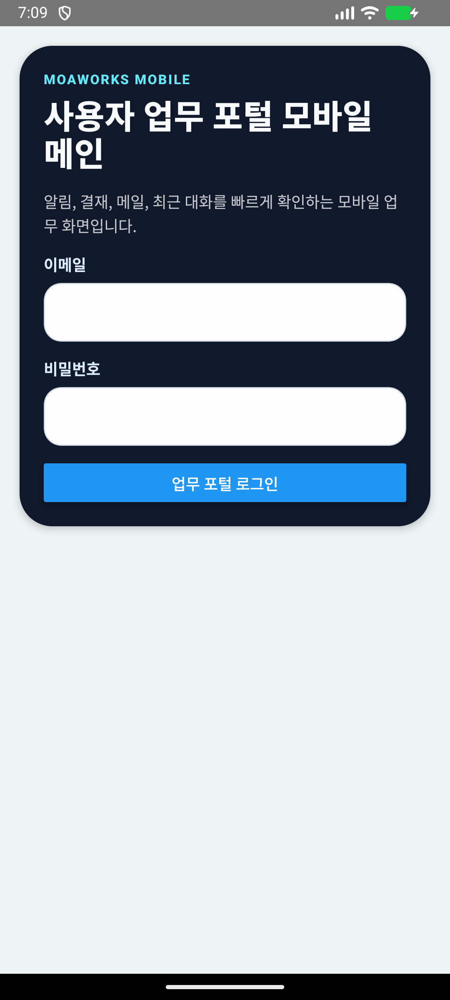

*그림 24. Android 앱 로그인 화면입니다.*

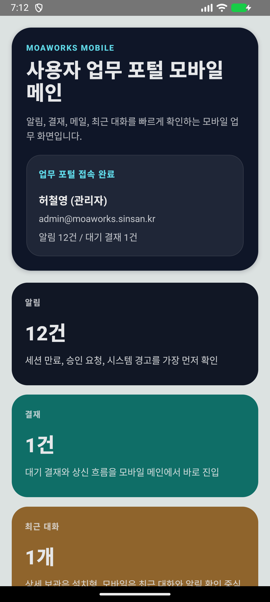

*그림 25. 모바일 화면에 맞춘 주요 업무 요약입니다.*

### 11.2 모바일 주요 업무

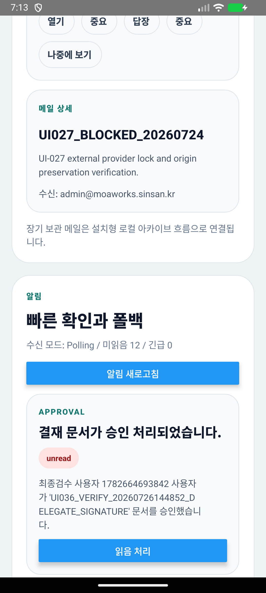

*그림 26. 실제 서버 데이터와 연결된 모바일 메일 화면입니다.*

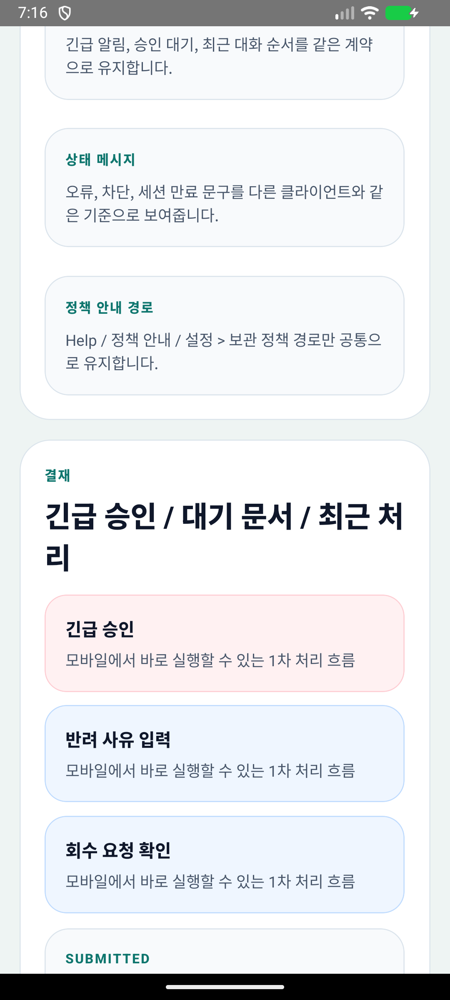

*그림 27. 모바일에서 결재 문서와 상태를 확인합니다.*

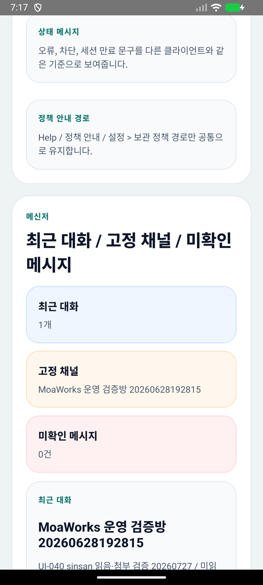

*그림 28. 모바일 메신저 대화와 메시지 입력 화면입니다.*

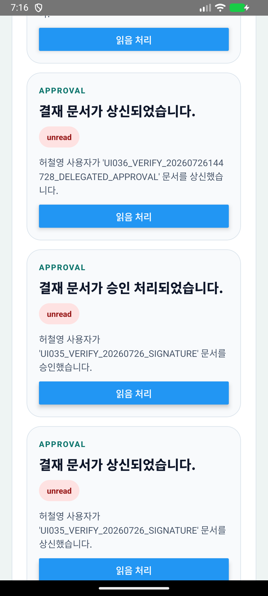

*그림 29. 모바일 알림 목록에서 새 업무를 확인합니다.*

> iOS 프로젝트는 제공되지만 macOS/Xcode, Apple 서명, iPhone 네이티브 기능 검증은 승인된 보류 상태입니다. 검증 완료 공지가 있기 전에는 회사의 지원 범위를 확인하십시오.

## 12. 보안과 문제 해결

### 12.1 반드시 지킬 사항

- 비밀번호와 인증 코드를 메일·메신저로 보내지 않습니다.
- 출처를 모르는 첨부 파일과 링크를 열지 않습니다.
- 공용 PC에서는 사용 후 반드시 로그아웃합니다.
- 주소창이 HTTPS이고 회사가 안내한 도메인인지 확인합니다.
- 다른 사용자의 권한이나 자료가 보이면 즉시 작업을 중단하고 관리자에게 알립니다.

### 12.2 증상별 확인

| 증상 | 사용자가 확인할 내용 | 관리자에게 전달할 내용 |
|---|---|---|
| 로그인 실패 | 아이디, 도메인, Caps Lock, 계정 잠금 안내 | 발생 시각, 사용자 이메일, 표시 문구 |
| 화면이 비어 있음 | 새로고침, 메뉴 재선택, 네트워크 연결 | 메뉴명, 발생 시각, 화면 캡처 |
| 메일 발송 실패 | 주소·첨부·예약 시간 | 발신자, 수신자 도메인, 제목, 발생 시각 |
| 외부 메일 미표시 | 받은편지함·스팸함 검색 | 상대 주소, 제목, 발송 시각 |
| 결재 버튼 비활성 | 현재 순번과 문서 상태 | 문서 제목·상태·현재 결재자 |
| 메시지 동기화 지연 | 대화방 재선택, 연결 상태 | 대화방명과 마지막 정상 시각 |
| 파일 업로드 실패 | 파일 크기·형식·연결 | 파일명, 크기, 표시 오류 |

## 13. 사용자 완료 체크리스트

- [ ] 회사 HTTPS 주소로 로그인했다.
- [ ] 홈에서 내 업무 요약을 확인했다.
- [ ] 메일 작성·임시저장·즉시 또는 예약 발송 방법을 확인했다.
- [ ] 결재 작성·상신과 승인·반려 흐름을 확인했다.
- [ ] 메신저 대화와 파일 공유 방법을 확인했다.
- [ ] 일정과 조직도·주소록을 사용할 수 있다.
- [ ] 파일 업로드·공유·버전·휴지통 정책을 이해했다.
- [ ] 개인 프로필과 알림 설정을 확인했다.
- [ ] 문제 발생 시 관리자에게 전달할 정보를 알고 있다.
