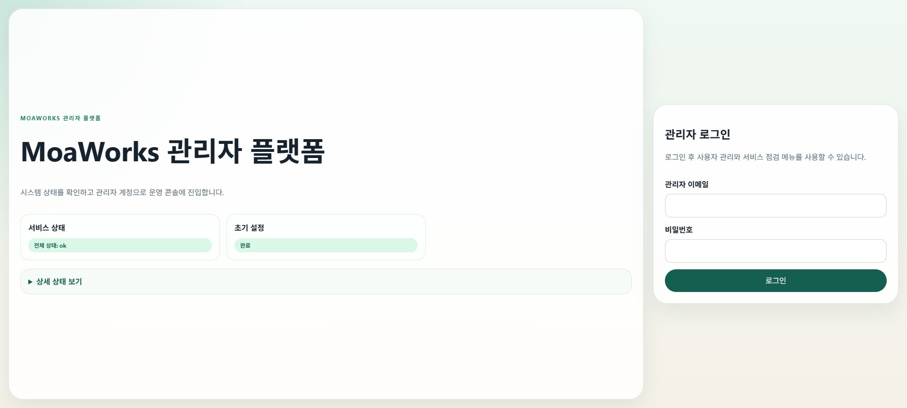

# MoaWorks 장애·백업·복구 메뉴얼 v2.0

> 대상: 시스템 운영자, 장애 대응자, 백업 관리자
> 원칙: 서비스 복구보다 증적 보존과 데이터 안전을 먼저 확인
> 관련 문서: [관리자·운영자 메뉴얼](moaworks-admin-operator-manual-v2.0.md), [설치·배포 메뉴얼](moaworks-install-deploy-manual-v2.0.md)

## 1. 장애 대응 기본 원칙

1. 발생 시각, 최초 신고, 영향 사용자를 기록합니다.
2. 현재 환경·버전·최근 변경을 확인합니다.
3. 로그, 상태, DB, 큐, 저장소를 삭제하거나 초기화하지 않습니다.
4. 동일 명령을 반복 실행하거나 무작정 컨테이너를 재시작하지 않습니다.
5. 읽기 전용 점검으로 범위를 좁힌 뒤 하나의 복구 조치만 적용합니다.
6. 조치 후 기술 상태와 실제 사용자 흐름을 모두 확인합니다.
7. 원인·조치·결과·재발 방지를 기록합니다.

## 2. 심각도와 보고

| 등급 | 기준 | 첫 조치 | 목표 |
|---|---|---|---|
| SEV-1 | 전체 로그인·메일·DB 불가, 데이터 손실 의심 | 변경 동결, 총괄 호출, 증적 보존 | 즉시 우회·복구 |
| SEV-2 | 핵심 기능 일부 불가, 다수 사용자 영향 | 담당자 배정, 영향 범위 확인 | 업무시간 내 복구 |
| SEV-3 | 제한된 사용자·기능 오류 | 티켓화, 재현과 로그 수집 | 계획된 수정 |
| SEV-4 | 문의·개선·경고 | 운영 기록 | 다음 배포 반영 |

초기 보고에는 다음을 포함합니다.

- 장애 번호와 등급
- 시작·발견 시각
- 영향 URL·기능·사용자 범위
- 마지막 정상 시각
- 최근 배포·설정·DNS·인증서 변경
- 현재 시행한 조치와 담당자
- 다음 업데이트 시각

## 3. 공통 초동 점검

### 3.1 화면 점검



*화면 예시 1 — 장애 초동 단계에서 서비스 상태와 운영 정보를 확인하는 관리자 화면*

1. 사용자 HTTPS 주소를 엽니다.
2. 관리자 HTTPS 주소를 엽니다.
3. 로그인 전 상태와 인증서를 확인합니다.
4. 로그인 후 홈, 메일, 결재를 각각 엽니다.
5. 관리자 상태 화면에서 마지막 점검 시각을 확인합니다.

### 3.2 서버 점검

실행 위치: MoaWorks 배포 서버의 배포 디렉터리.

```bash
docker compose ps
docker compose logs --since 30m --tail 300
```

정상 결과: 필수 서비스가 `running/healthy`이며 같은 오류가 반복되지 않습니다.
중단 조건: 재시작 횟수가 증가하거나 DB·마이그레이션·스토리지 오류가 보이면 `down`, 볼륨 삭제, 이미지 강제 재생성을 실행하지 않습니다.

### 3.3 기록할 증적

- `docker compose ps` 결과
- 오류 발생 전후 로그
- 브라우저 오류 문구와 Network 요청 URL·상태 코드
- 디스크·메모리·DB 연결 상태
- 메일 큐·백업 작업·인증서 만료 상태
- 최근 변경 커밋·이미지 태그·환경 설정 변경 시각

비밀번호, 토큰, 세션 쿠키, 메일 본문, 개인 정보는 마스킹합니다.

## 4. 웹 접속·로그인 장애

### 4.1 DNS·TLS·Reverse Proxy 분리

1. DNS가 의도한 공인 IP를 반환하는지 확인합니다.
2. HTTPS 인증서의 도메인·만료일·발급자를 확인합니다.
3. Reverse Proxy가 user-web/admin-web 대상으로 연결되는지 확인합니다.
4. 정적 화면은 열리지만 로그인만 실패하면 API와 DB로 범위를 좁힙니다.
5. 브라우저 Network에서 내부 IP·컨테이너명·내부 포트 호출이 없는지 확인합니다.

| 증상 | 가능 영역 | 확인 |
|---|---|---|
| 도메인을 찾지 못함 | DNS | 권한 이름 서버와 A 레코드 |
| 인증서 경고 | TLS | 인증서 도메인·체인·갱신 |
| 502/504 | Proxy·앱 | 대상 컨테이너와 포트 |
| 로그인 401/403 | 계정·세션·권한 | 계정 상태, 서버 시간, 감사 로그 |
| 로그인 후 빈 화면 | API·브라우저 | Network 상태와 same-origin |

### 4.2 복구 판정

로그인 페이지 표시만으로 복구 완료라고 판단하지 않습니다. 관리자와 일반 사용자가 각각 로그인하고 홈·메일·결재의 실제 데이터를 확인해야 합니다.

## 5. 데이터베이스 장애

### 5.1 금지 조치

- 운영 DB 볼륨 삭제
- 빈 DB로 자동 초기화
- 영향 확인 없는 마이그레이션 재실행
- 대량 DELETE·TRUNCATE
- 운영 DB에 개발 백업 덮어쓰기

### 5.2 점검 순서

1. DB 컨테이너 또는 외부 DB 상태를 확인합니다.
2. 디스크 여유, 연결 수, 잠금, 최근 오류를 확인합니다.
3. 애플리케이션의 DB 연결 문자열이 현재 환경을 가리키는지 확인합니다.
4. 마지막 성공 백업과 복원 시험 시각을 확인합니다.
5. 손상 또는 데이터 손실이 의심되면 쓰기를 중지하고 복구 담당자에게 넘깁니다.

### 5.3 복구 완료 조건

- 스키마 버전이 배포 버전과 일치
- 사용자·조직·메일·결재·파일 메타데이터 수량이 기대 범위
- 신규 쓰기와 조회가 모두 성공
- 감사 로그가 연속됨
- 사용자 대표 흐름이 실제로 성공

## 6. 메일 장애

### 6.1 발신 장애

1. 현재 선택된 Provider를 확인합니다.
2. 연결 테스트 결과와 마지막 성공 시각을 확인합니다.
3. 발송 큐의 대기·재시도·실패를 구분합니다.
4. SMTP 응답 코드와 수신자 도메인을 기록합니다.
5. OCI SMTP 발신과 OCI 관리 API 권한을 별개로 확인합니다.
6. 외부 Outlook·Gmail로 실제 한 건을 보내 도착 또는 스팸함을 확인합니다.

### 6.2 수신 장애

1. MX가 올바른 메일 서버를 가리키는지 확인합니다.
2. 메일 서버 A 레코드가 DNS 전용인지 확인합니다.
3. 외부에서 TCP 25가 실제 도달하는지 확인합니다.
4. 수신 로그에서 연결·수락·큐·저장 단계를 추적합니다.
5. MoaWorks 받은편지함과 `processed/inbox` 저장 결과를 확인합니다.

### 6.3 장애 구분

| 현상 | 기능 상태 | 대응 |
|---|---|---|
| 외부 도착, 스팸함 | 전송 성공, 평판·정책 문제 | SPF·DKIM·DMARC·PTR·평판 개선 |
| SMTP 2xx, 외부 미도착 | 최종 전달 미확인 | Provider 추적·반송·수신 서버 확인 |
| 외부 수신 연결 없음 | DNS·TCP 25 문제 | MX·A·방화벽·회선 확인 |
| 수락 후 받은편지함 없음 | 내부 큐·파서·DB 문제 | 메시지 ID로 저장 경로 추적 |
| 회신이 원문과 연결 안 됨 | 스레드 식별 문제 | Message-ID·References 보존 확인 |

### 6.4 Provider 전환

전환 전 현재 큐와 마지막 성공을 기록합니다. 대기 메시지를 중복 발송하지 않는지 확인하고, 연결 테스트와 실제 외부 왕복을 완료한 뒤 전환 상태를 확정합니다. 문제가 있으면 원 Provider와 설정값으로 되돌립니다.

## 7. 파일·스토리지 장애

1. 디스크·오브젝트 스토리지 사용량과 마운트를 확인합니다.
2. DB 메타데이터와 실제 객체의 일치 여부를 확인합니다.
3. 업로드 실패 파일의 이름·크기·해시·시각을 기록합니다.
4. 악성 파일 의심 시 공유를 중지하고 원본을 격리합니다.
5. 버전·휴지통·보관 기간이 남은 자료를 직접 삭제하지 않습니다.

복구 완료 조건은 기존 파일 다운로드, 신규 업로드, 버전 생성, 권한 있는 공유가 모두 성공하는 것입니다.

## 8. 결재·메신저·알림 장애

### 8.1 결재

- 문서 상태, 현재 결재자, 결재선, 마지막 이벤트를 확인합니다.
- 관리자가 DB를 직접 수정해 상태를 건너뛰지 않습니다.
- 중복 승인·반려가 발생하지 않도록 요청 식별자와 감사 로그를 확인합니다.

### 8.2 메신저

- WebSocket 연결과 재연결 상태를 확인합니다.
- 방 목록과 메시지 저장, 읽음 상태를 분리해 확인합니다.
- 브라우저 새로고침만으로 복구 판정하지 않고 두 사용자 간 실제 송수신을 확인합니다.

### 8.3 알림

- 원본 업무 이벤트가 생성되었는지 먼저 확인합니다.
- 사용자 알림 설정, 서버 알림 생성, 웹·모바일 전달 단계를 분리합니다.
- 알림을 눌렀을 때 원본 업무로 이동하는지 확인합니다.

## 9. 인증서 장애와 갱신

1. 만료일과 인증서 lineage를 확인합니다.
2. 자동 갱신 작업의 마지막 실행과 결과를 확인합니다.
3. 인증서가 실제 서비스에 로드된 해시와 갱신된 파일 해시를 비교합니다.
4. 변경이 있을 때만 대상 서비스를 재시작합니다.
5. 재시작 직후와 안정화 후 `running` 상태와 재시작 횟수를 비교합니다.
6. HTTPS와 SMTP TLS를 외부에서 다시 확인합니다.

**중단 조건:** 인증서 파일, 서비스 이름, lineage가 일치하지 않거나 재시작 횟수가 증가하면 자동 성공으로 기록하지 않습니다.

## 10. 백업 정책

### 10.1 백업 대상

| 대상 | 예시 | 권장 주기 |
|---|---|---|
| PostgreSQL | 사용자·조직·메일 메타·결재·감사 | 매일 + 중요 변경 전 |
| 메일 저장소 | 원문·첨부·큐 | 매일 또는 증분 |
| 파일 저장소 | 업로드·버전·공유 자료 | 매일 또는 증분 |
| 설정 | Compose·프록시·정책·환경 템플릿 | 변경 시 |
| 인증서 메타 | 설정·lineage, 개인키는 보호 저장 | 변경 시 |
| 운영 증적 | 배포·장애·감사 내보내기 | 정책에 따라 |

### 10.2 3-2-1 원칙

- 데이터 사본 3개
- 서로 다른 매체 2개
- 운영 환경과 분리된 위치 1개

백업은 암호화하고 접근 권한을 분리합니다. 백업 파일명에 비밀번호나 개인 정보를 넣지 않습니다.

### 10.3 성공 판정

백업 명령 성공만으로 완료라고 판단하지 않습니다.

- 파일이 존재하고 크기가 0이 아님
- 체크섬이 기록됨
- 보관 기간과 암호화가 적용됨
- 운영과 분리된 환경에서 복원이 성공함
- 복원된 데이터의 대표 업무가 조회됨

## 11. 복원 절차

### 11.1 준비

1. 장애 번호와 복원 승인을 기록합니다.
2. 대상 환경을 운영과 분리합니다.
3. 복원 시점과 데이터 손실 범위를 합의합니다.
4. 현재 손상 상태도 별도 보존합니다.
5. 애플리케이션 쓰기를 중지합니다.

### 11.2 순서

1. 승인된 버전의 인프라와 애플리케이션을 준비합니다.
2. DB를 복원하고 스키마·건수·감사 연속성을 확인합니다.
3. 메일·파일 저장소를 복원하고 메타데이터와 대조합니다.
4. 비밀값과 인증서를 안전한 저장소에서 연결합니다.
5. 내부 상태 점검을 통과한 뒤 Reverse Proxy에 연결합니다.
6. 관리자와 일반 사용자 대표 흐름을 확인합니다.
7. 쓰기를 재개하고 지연된 큐가 중복 처리되지 않는지 관찰합니다.

### 11.3 사용자 검증

- 로그인
- 홈 요약
- 기존·신규 메일 조회 및 발송
- 결재 문서 조회와 새 기안
- 두 사용자 메신저 송수신
- 일정 조회·등록
- 파일 다운로드·업로드·버전
- 알림 생성·읽음·원본 이동

## 12. 업데이트와 롤백

### 12.1 업데이트 전

- 승인된 커밋·태그·이미지 확인
- DB 및 저장소 백업
- 마이그레이션과 되돌리기 가능성 확인
- 유지보수 공지
- 현재 상태·큐·재시작 횟수 기록

### 12.2 배포 후

1. 컨테이너 상태와 로그를 확인합니다.
2. DB 마이그레이션 버전을 확인합니다.
3. same-origin Network를 확인합니다.
4. 대표 업무와 외부 메일 왕복을 실행합니다.
5. 오류율·큐·재시작 횟수를 안정화 시간 동안 관찰합니다.

### 12.3 롤백 조건

- 로그인 또는 핵심 업무 불가
- 데이터 손상·중복 처리 의심
- 지속적인 컨테이너 재시작
- 마이그레이션 실패
- 내부 API 주소가 브라우저에 노출
- 외부 메일 왕복 실패가 배포와 직접 연관

## 13. 재해 복구 훈련

분기 또는 회사 정책 주기로 다음을 훈련합니다.

1. 운영과 분리된 서버를 준비합니다.
2. 최신 승인 백업을 복원합니다.
3. DNS를 변경하지 않고 임시 호스트 또는 제한된 검증 경로를 사용합니다.
4. 사용자 대표 흐름을 실행합니다.
5. 실제 RTO·RPO, 누락 데이터, 수동 절차를 기록합니다.
6. 메뉴얼과 자동화 개선 항목을 운영 변경으로 등록합니다.

## 14. 장애 종료 보고서

| 항목 | 내용 |
|---|---|
| 장애 번호·등급 |  |
| 시작·발견·복구·종료 시각 |  |
| 영향 범위 |  |
| 마지막 정상 상태 |  |
| 직접 원인 |  |
| 기여 요인 |  |
| 시행 조치 |  |
| 데이터 손실·중복 여부 |  |
| 실제 사용자 검증 |  |
| 재발 방지와 담당자·기한 |  |
<!-- pagebreak -->


## 15. 운영 완료 체크리스트

- [ ] 장애 등급·영향·최근 변경을 기록했다.
- [ ] 로그·DB·큐·스토리지를 삭제하지 않고 증적을 보존했다.
- [ ] 원인을 좁힌 뒤 하나의 복구 조치만 적용했다.
- [ ] 기술 상태와 실제 사용자 흐름을 모두 검증했다.
- [ ] 메일은 발신·수신·저장·회신·스팸 판정을 구분했다.
- [ ] 백업은 체크섬과 분리 환경 복원으로 검증했다.
- [ ] 업데이트 전 백업과 롤백 기준을 확정했다.
- [ ] 종료 보고서와 재발 방지 담당자·기한을 기록했다.
