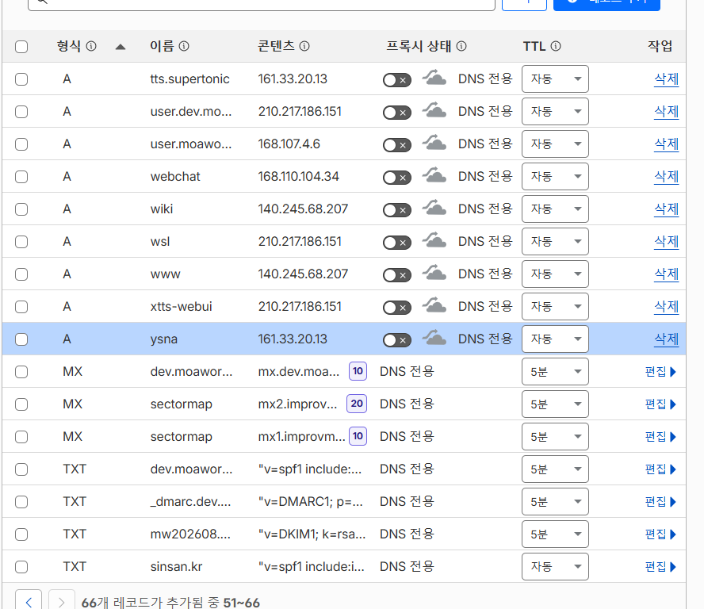
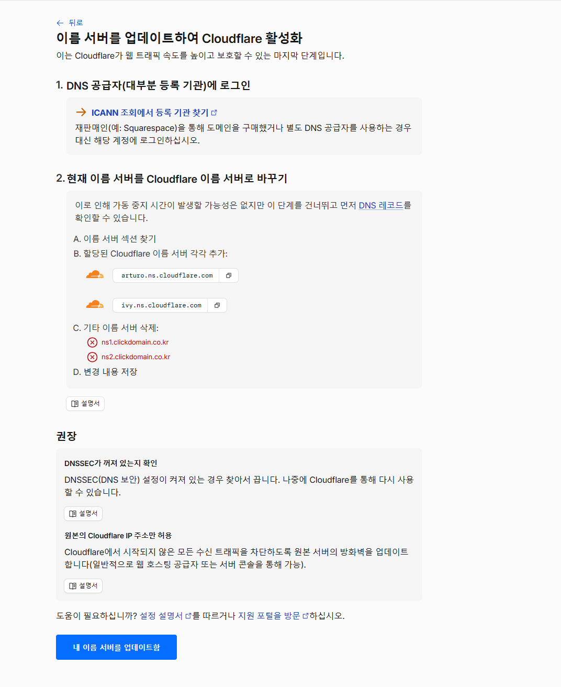
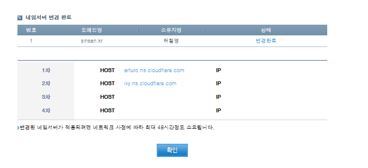
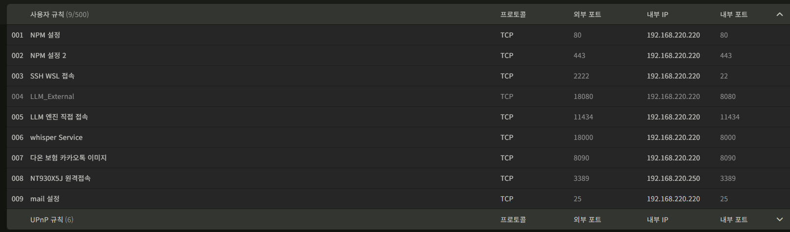
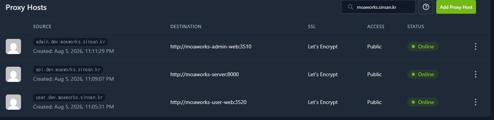
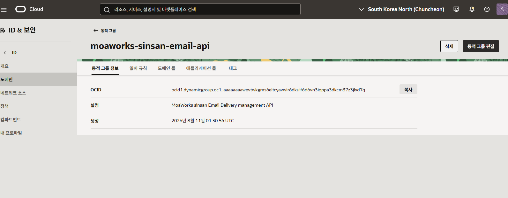
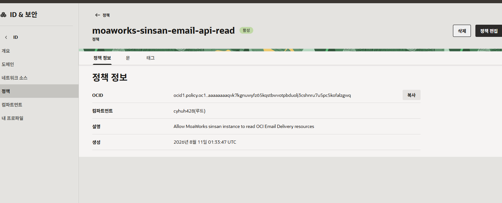

# MoaWorks 설치·배포 메뉴얼 v2.0

> 대상: 설치 담당자, 인프라 운영자, 시스템 관리자
> 목표: 신규 조직이 웹·메일·관리자·클라이언트 기능을 재현 가능한 절차로 설치
> 예시 도메인: `company.com`
> 기준 배포: Docker Compose + PostgreSQL + Reverse Proxy + HTTPS

이 메뉴얼의 명령은 설치 담당자만 실행합니다. 일반 사용자와 업무 관리자는 명령줄을 사용하지 않습니다. 비밀번호, API 키, SMTP 자격 증명, 개인키, 전체 OCID는 문서나 Git 저장소에 기록하지 않습니다.

## 1. 설치 구조와 주소 결정

### 1.1 필수 주소

| 용도 | 권장 주소 | 외부 공개 | 설명 |
|---|---|---:|---|
| 사용자 포털 | `user.company.com` | 필수 | 웹·데스크톱·모바일 사용자가 접속 |
| API/BFF | 사용자 포털의 같은 출처 경로 | 필수 | 브라우저는 `/api/v1/*` 상대 경로 사용 |
| 외부 메일 수신 | `mail.company.com` | 필수 | MX가 가리키는 SMTP 서버 |
| 관리자 | `admin.company.com` | 선택 | VPN·사내망·허용 IP로 제한 가능 |
| 개발 사용자 | `user.dev.company.com` | 선택 | 운영과 분리된 검증 환경 |
| 개발 메일 | `mail.dev.company.com` | 선택 | 자체 엔진 검증용 |

모든 주소가 같은 공인 IP를 사용해도 됩니다. Reverse Proxy는 HTTP/HTTPS 호스트 이름으로 서비스를 구분하고, SMTP는 별도의 포트와 메일 서버가 처리합니다.

### 1.2 메일 도메인과 서버 이름

- 사용자의 메일 주소가 `name@company.com`이면 메일 도메인은 `company.com`입니다.
- `mail.company.com`은 메일을 처리하는 서버 이름입니다.
- MX 레코드는 `company.com → mail.company.com` 형태로 연결합니다.
- 개발 환경에서 `name@dev.company.com`을 사용하면 `dev.company.com → mail.dev.company.com` MX를 만듭니다.

## 2. 준비사항

### 2.1 서버

- 64비트 Linux 서버 또는 운영 목적의 OCI Compute
- 4 vCPU, 8GB RAM, 80GB SSD 이상 권장
- Docker Engine과 Compose Plugin
- PostgreSQL 15 이상
- 고정 공인 IP 권장
- 운영 환경은 TCP 80, 443과 메일 수신 TCP 25의 도달성 확인
- 관리자 SSH는 허용 IP 또는 VPN으로 제한

### 2.2 설치 전 기록

| 항목 | 기록할 값 |
|---|---|
| 등록 도메인 | 예: `company.com` |
| DNS 공급자 | Cloudflare 또는 동등한 권한 DNS |
| 공인 IP | 웹·메일별 IP |
| 내부 서버 IP | Reverse Proxy와 애플리케이션 대상 |
| DB 호스트·DB명 | 비밀번호 제외 |
| 사용자·관리자 주소 | 최종 HTTPS URL |
| 메일 Provider | OCI 또는 자체 엔진 |
| 백업 위치 | 운영 데이터와 분리된 저장소 |

## 3. DNS를 Cloudflare로 이전

### 3.1 기존 레코드 조사

1. 현재 DNS 공급자에서 A, AAAA, CNAME, MX, TXT 레코드를 내보냅니다.
2. 사용 중인 모든 하위 도메인과 IP를 목록화합니다.
3. Cloudflare가 자동 탐지하지 못한 레코드를 직접 추가합니다.
4. 기존 사이트·메일·인증 레코드가 모두 준비되기 전에는 이름 서버를 변경하지 않습니다.



*화면 예시 1 — A·MX·TXT 레코드와 DNS 전용 상태 확인*

웹 레코드는 필요에 따라 프록시를 사용할 수 있지만, **메일 서버 A 레코드와 MX·TXT 레코드는 DNS 전용**으로 둡니다. Cloudflare HTTP 프록시는 SMTP를 대신하지 않습니다.

### 3.2 이름 서버 변경

1. Cloudflare에 루트 도메인을 추가하고 무료 플랜을 선택합니다.
2. 할당된 이름 서버 두 개를 복사합니다.



*화면 예시 2 — 등록 기관에 입력할 Cloudflare 권한 이름 서버*

3. 도메인 등록 기관에서 기존 이름 서버를 제거하고 두 이름 서버를 입력합니다.



*화면 예시 3 — 기존 이름 서버를 Cloudflare 이름 서버로 교체한 완료 화면*

4. Cloudflare가 **활성**으로 표시할 때까지 기다립니다.
5. 이전 레코드가 새 권한 DNS에서 동일하게 응답하는지 확인합니다.

**중단 조건:** 사용 중인 A·MX 레코드가 누락되었거나 DNSSEC 상태를 확인하지 못했으면 이름 서버를 변경하지 않습니다.

## 4. 필수 DNS 레코드

### 4.1 웹과 관리자

| 형식 | 이름 | 값 | 프록시 |
|---|---|---|---|
| A | `user` | 웹 공인 IP | 운영 정책에 따라 |
| A | `admin` | 관리자 공인 IP | 외부 공개 시 정책에 따라 |
| A | `mail` | SMTP 공인 IP | DNS 전용 |

### 4.2 외부 메일 수신

| 형식 | 이름 | 값 | 우선순위 |
|---|---|---|---:|
| MX | `@` | `mail.company.com` | 10 |

`mail.company.com`의 A 레코드가 실제로 TCP 25를 수신하는 공인 IP를 가리켜야 합니다. 포트 465와 587은 사용자가 메일 서버에 제출하는 암호화 포트이며, 인터넷 메일 서버 간 MX 전달은 TCP 25를 사용합니다.

### 4.3 SPF·DKIM·DMARC

- SPF는 실제 발신 경로만 허용하고 여러 SPF TXT 레코드를 만들지 않습니다.
- DKIM 공개키는 발급된 selector 이름에 TXT로 등록합니다.
- DMARC는 처음에는 보고 중심 정책으로 시작하고 결과를 확인한 뒤 강화합니다.
- 운영 OCI 발신과 개발 자체 엔진 발신이 다르면 각 메일 도메인별로 레코드를 분리합니다.

예시 구조:

```text
company.com                  TXT  v=spf1 include:<provider-spf> -all
<selector>._domainkey        TXT  v=DKIM1; k=rsa; p=<public-key>
_dmarc                       TXT  v=DMARC1; p=none; rua=mailto:dmarc@company.com
```

실제 Provider가 안내한 값을 사용합니다. `<provider-spf>`와 `<public-key>`를 그대로 등록하지 않습니다.

## 5. 방화벽과 포트 전달

### 5.1 외부 포트

| 포트 | 방향 | 목적 |
|---:|---|---|
| 80/TCP | 외부→Reverse Proxy | HTTPS 인증서 발급·HTTP 리디렉션 |
| 443/TCP | 외부→Reverse Proxy | 사용자·관리자 HTTPS |
| 25/TCP | 외부→메일 서버 | 외부 메일 서버의 MX 전달 |
| 22/TCP | 제한된 관리망→서버 | SSH 관리, 외부 전체 공개 금지 |



*화면 예시 4 — 외부 포트를 내부 서버로 전달하는 예시*

가정용·유동 IP 회선은 통신사가 인바운드 TCP 25를 차단하거나 PTR을 제공하지 않을 수 있습니다. 이런 회선은 운영 메일 서버로 적합하지 않습니다. 개발 환경에서는 별도 수신 릴레이 또는 TCP 25가 가능한 서버를 사용합니다.

## 6. 저장소와 환경 파일 준비

### 6.1 실행 위치

운영 서버의 MoaWorks 배포 디렉터리에서 실행합니다.

```bash
git clone <public-or-private-repository-url> MoaWorks
cd MoaWorks
git checkout <approved-release-tag-or-branch>
```

정상 결과: 저장소가 내려받아지고 승인된 태그 또는 브랜치가 표시됩니다.
중단 조건: 출처가 다른 원격 저장소, 승인되지 않은 커밋, 로컬 미확인 수정이 있으면 배포하지 않습니다.

### 6.2 환경 파일

1. 저장소가 제공하는 예제 환경 파일을 복사합니다.
2. DB, 세션, 암호화, SMTP 비밀값은 서버의 보호된 파일 또는 비밀 저장소에 입력합니다.
3. 환경 파일 권한을 서비스 계정만 읽도록 제한합니다.
4. 브라우저용 공개 환경 변수에 내부 API 주소를 넣지 않습니다.

브라우저는 `https://user.company.com/api/v1/...` 같은 같은 출처 상대 경로를 호출합니다. 내부 컨테이너 주소는 Reverse Proxy·BFF·서버 코드에서만 사용합니다.

## 7. PostgreSQL 준비

1. 운영 전용 DB와 최소 권한 사용자를 만듭니다.
2. 문자 인코딩과 시간대를 확인합니다.
3. 외부 전체 네트워크에서 DB 포트를 열지 않습니다.
4. 배포 전 백업과 복원 시험을 완료합니다.
5. 스키마 초기화·마이그레이션은 배포 절차에서 한 번만 실행합니다.

정상 결과: 애플리케이션 컨테이너에서 DB 연결 점검이 성공합니다.
중단 조건: 개발 DB, 다른 서비스의 공유 DB, 비어 있지 않은 대상에 적용할 마이그레이션 영향이 확인되지 않으면 진행하지 않습니다.

## 8. 컨테이너 배포

### 8.1 사전 검사

```bash
docker compose config
docker compose pull
```

정상 결과: 구성 오류 없이 최종 Compose 설정이 출력되고 이미지 가져오기가 완료됩니다.
중단 조건: 비밀값이 출력에 노출되거나 이미지 태그가 승인 버전과 다르면 중단합니다.

### 8.2 시작

```bash
docker compose up -d
docker compose ps
```

정상 결과: API, user-web, admin-web, worker와 필요한 인프라가 `running` 또는 `healthy`입니다.
중단 조건: 재시작 횟수가 증가하거나 DB 마이그레이션이 실패하면 반복 재시작하지 말고 장애 메뉴얼을 적용합니다.

## 9. Reverse Proxy와 HTTPS

### 9.1 Proxy Host



*화면 예시 5 — 사용자·관리자·API 호스트와 내부 컨테이너 연결*

1. `user.company.com`을 user-web 서비스에 연결합니다.
2. `admin.company.com`을 admin-web 서비스에 연결합니다.
3. API는 외부 전용 호스트보다 사용자 포털의 `/api` 경로로 프록시합니다.
4. WebSocket, 업로드 크기, 시간 제한을 제품 기준에 맞춥니다.
5. Let's Encrypt 인증서를 발급하고 HTTP→HTTPS 리디렉션을 켭니다.
6. 관리자 주소는 VPN·허용 IP·추가 인증으로 제한할 수 있습니다.

### 9.2 브라우저 검증

1. 사용자·관리자 주소에서 인증서 경고가 없는지 확인합니다.
2. 로그인 후 주요 메뉴를 한 번씩 엽니다.
3. 개발자 도구 Network에서 요청의 호스트가 현재 웹 주소와 일치하는지 확인합니다.
4. 브라우저 요청에 내부 IP, 컨테이너명, 내부 포트가 나타나면 배포를 승인하지 않습니다.

## 10. OCI Email Delivery 발신

### 10.1 SMTP 발신

1. OCI Email Delivery에서 승인된 발신 도메인과 발신자를 구성합니다.
2. SMTP 자격 증명을 별도로 생성합니다.
3. MoaWorks Provider를 OCI로 선택하고 SMTP 호스트, 포트 587, TLS, 자격 증명을 비밀 저장소에 입력합니다.
4. 관리자 화면의 연결 테스트를 실행합니다.
5. Outlook·Gmail 등 외부 주소로 실제 메일을 보내 도착과 Authentication-Results를 확인합니다.
6. 외부에서 회신하고 MoaWorks 받은편지함에 저장되는지 확인합니다.

OCI의 SMTP 587 발신은 외부 메일 제출 경로입니다. 인스턴스에서 외부 MX로 직접 발신하는 TCP 25와는 별개입니다.

### 10.2 Instance Principal 조회

억제 목록과 Email Delivery 상태를 API로 읽을 때만 설정합니다.

1. OCI 인스턴스를 식별하는 동적 그룹을 생성합니다.



*화면 예시 6 — MoaWorks 인스턴스를 Instance Principal 그룹에 포함*

일치 규칙 예시:

```text
instance.id = '<target-instance-ocid>'
```

2. 동적 그룹 이름을 사용해 정책을 생성합니다.

```text
Allow dynamic-group <dynamic-group-name> to read email-family in tenancy
Allow dynamic-group <dynamic-group-name> to read metrics in tenancy
```



*화면 예시 7 — 동적 그룹에 Email Delivery와 지표 조회 권한 부여*

3. 인스턴스에서 API 연결 테스트를 실행하고 관리자 화면에 성공 상태가 표시되는지 확인합니다.
4. 권한이 확인되기 전에는 OCI API 동기화를 활성화하지 않습니다. SMTP 발신 성공만으로 API 권한이 있다고 판단하지 않습니다.

## 11. 자체 메일 엔진

### 11.1 목적

- 외부 SMTP 수신
- 사용자 메일함 저장
- 외부 도메인 발신
- 회신 왕복과 읽음·실패 상태 처리

### 11.2 개발 환경 분리

운영 `company.com`은 OCI 발신, 개발 `dev.company.com`은 자체 엔진으로 분리할 수 있습니다. 소스는 동일하게 유지하고 환경 설정과 DB·도메인만 구분합니다.

### 11.3 검증

1. `dev.company.com` MX가 `mail.dev.company.com`을 가리키는지 확인합니다.
2. 외부에서 개발 사용자에게 메일을 보내 받은편지함 저장을 확인합니다.
3. 개발 사용자에서 Outlook·Gmail로 발송합니다.
4. 외부 도착 또는 스팸함 도착을 확인하고 원본 헤더를 보존합니다.
5. 외부에서 회신하여 개발 받은편지함에 저장되는지 확인합니다.

스팸 판정은 기능 구현과 별도로 IP 평판, PTR, 발신량, SPF·DKIM·DMARC 정책으로 개선합니다.

## 12. 초기 관리자 설정

1. 설치 시 임시 관리자 계정을 생성합니다.
2. 최초 로그인에서 비밀번호를 변경합니다.
3. 회사명, 기본 도메인, 시간대, 보관 정책을 입력합니다.
4. 조직 루트와 첫 부서를 만듭니다.
5. 운영 관리자와 사용자 관리자를 분리합니다.
6. 메일 Provider와 LLM Provider는 각각 연결 테스트 후 활성화합니다.
7. 임시 설치 계정과 사용하지 않는 기본 자격 증명을 제거합니다.

## 13. 클라이언트 배포

### 13.1 웹

- 별도 설치 없이 HTTPS 사용자 주소를 사용합니다.
- 지원 브라우저, 팝업·다운로드 정책을 사내 안내에 포함합니다.

### 13.2 데스크톱·Portable

- 서명된 배포 파일과 체크섬을 제공합니다.
- 서버 주소는 회사 HTTPS 주소만 입력하도록 안내합니다.
- 업데이트와 로컬 메일 아카이브 경로를 사용자에게 알립니다.

### 13.3 Android

- 승인된 APK/AAB 배포 경로를 사용합니다.
- 설치 후 로그인·홈·메일·결재·메신저·알림을 실기기에서 확인합니다.

### 13.4 iOS

iOS의 macOS/Xcode, Apple 서명, iPhone 네이티브 기능 검증은 현재 보류 항목입니다. 검증 완료 전에는 iOS 지원 완료로 배포 공지하지 않습니다.

## 14. 설치 완료 검증

| 영역 | 실제 확인 |
|---|---|
| DNS | 권한 이름 서버, A, MX, SPF, DKIM, DMARC 응답 |
| HTTPS | 사용자·관리자 인증서와 리디렉션 |
| same-origin | Network에 내부 주소가 없고 `/api/v1/*` 사용 |
| 계정 | 관리자 생성, 일반 사용자 로그인, 권한 분리 |
| 메일 | OCI 발신, 외부 도착, 회신 수신, 자체 엔진 왕복 |
| 업무 | 메일·결재·메신저·일정·주소록·파일 |
| 알림 | 웹·Android 대표 이벤트 |
| 백업 | 자동 백업 성공과 별도 환경 복원 시험 |
| 감사 | 주요 변경과 로그인 기록 |

## 15. 설치 완료 체크리스트

- [ ] 도메인과 권한 DNS를 확정하고 기존 레코드를 모두 이전했다.
- [ ] 사용자·관리자·메일 주소와 공개 범위를 문서화했다.
- [ ] 메일 A·MX·TXT를 DNS 전용으로 등록했다.
- [ ] 웹 80/443과 외부 메일 수신 25의 도달성을 확인했다.
- [ ] DB를 외부에 노출하지 않고 백업·복원을 시험했다.
- [ ] 승인된 소스·이미지·환경 파일로 컨테이너를 시작했다.
- [ ] Reverse Proxy, HTTPS, same-origin Network를 검증했다.
- [ ] OCI SMTP와 Instance Principal API를 별개로 검증했다.
- [ ] 자체 메일 엔진의 외부 송수신과 저장을 검증했다.
- [ ] 웹·데스크톱·Android 대표 업무를 실제로 확인했다.
- [ ] iOS 보류 범위를 설치 완료 판정에서 명시적으로 제외했다.
